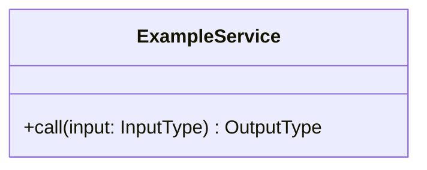
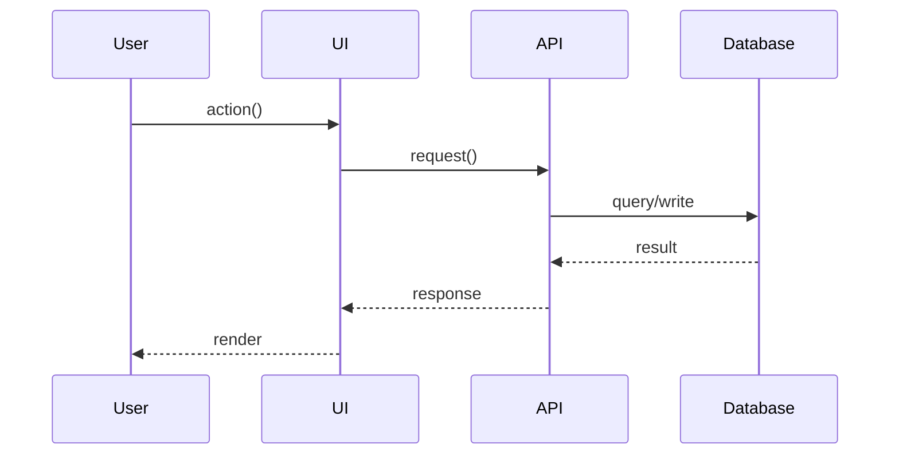
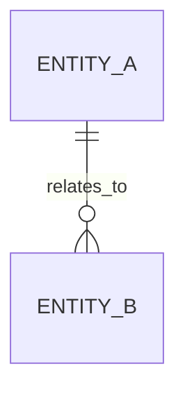

# Blueprint

Create technical blueprint artifacts between requirements and task planning.

## Purpose

Generate `FEATURE_DIR/blueprint.md` with:
- Requirement-vs-codebase gap summary from recon
- Proposed technical approach with explicit file create/update paths
- Mermaid class, sequence, and (if applicable) ER diagrams

## Execution Flow

1. Detect active scope.
- Use user-specified feature when provided.
- Otherwise locate latest `.cursor/scopes/*/requirements.md`.
- If ambiguous, ask which feature.
- Extract `FEATURE_NAME` from folder name after timestamp prefix.
- Set and report `FEATURE_DIR`.

2. Load `FEATURE_DIR/requirements.md`.
- If missing, stop and instruct to run design first.

3. Optionally load `FEATURE_DIR/uiux.md`.
- Use as UI input.
- If conflicting with requirements, prefer requirements and record conflicts in gap notes.

4. Perform recon (no implementation).
- Compare requirements to current code.
- Inspect relevant modules/components/services/models/tests and entry points.
- Identify existing capabilities, missing pieces, constraints, risks, and extension points.

5. Create `FEATURE_DIR/blueprint.md`:

```markdown
# Blueprint: [FeatureName]

## Requirement vs Codebase Gap (from requirements.md + recon)

- What exists already:
- Gaps (missing vs requirements):
- Constraints / boundaries:
- Risks / unknowns:

## Proposed Technical Design

- Approach:
- Key components / responsibilities:
- Data flow:
- Security / privacy considerations:
- Performance / scalability considerations:
- Errors / edge cases:

### File Plan (create/update)

- [new] `path/to/new_file.ext`: ...
- [change] `path/to/existing_file.ext`: ...

## UML Diagrams

### Class Diagram (with signatures)


### Sequence Diagram


### ER Diagram (if applicable)

```

6. Present and iterate.
- Confirm blueprint captures gaps and approach.
- Update until approved.

7. After approval.
- Recommend next step: use `plan` skill.

## Guidelines

- Lead with verified gaps.
- Keep file plan concrete.
- Keep diagrams aligned with proposed design.
- Do not implement code in this skill.
