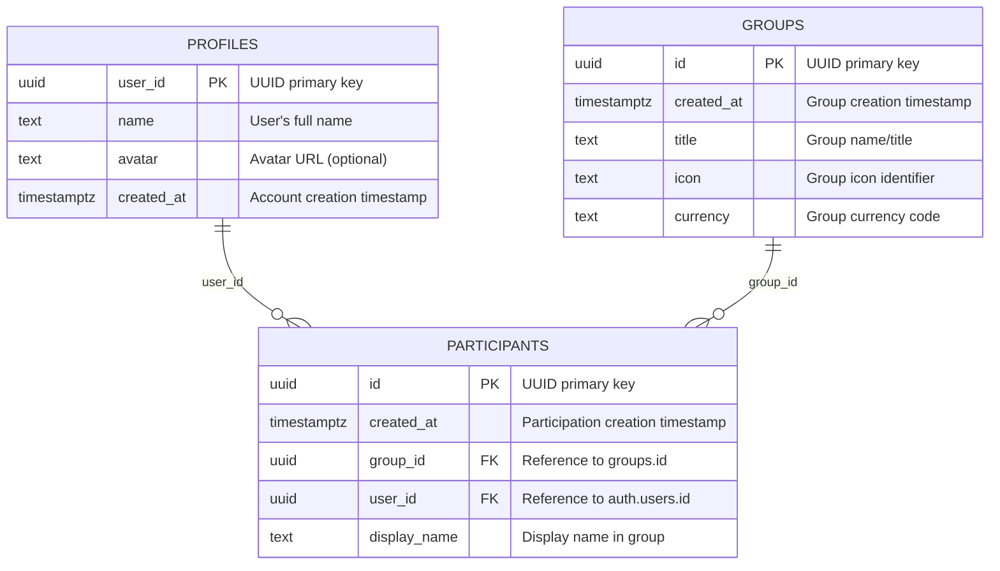

# Entity Relationship Diagram (ERD)

This document provides a visual representation of the database schema for the Scount expense tracking application using Supabase and Mermaid diagrams.

## Database Schema Overview

The Scount app currently implements a simplified database structure with three core tables: profiles, groups, and participants. This structure supports user management and group membership functionality.

## Entity Relationship Diagram



## Entity Descriptions

### 1. Profiles (Users)

- **Purpose**: Stores user account information and profile data
- **Key Fields**: `user_id` (UUID Primary Key), `name`, `avatar` (optional), `created_at`
- **Relationships**: Can participate in multiple groups via Participants table
- **Rules**:
  - `user_id` is a UUID and serves as the primary key
  - Links to Supabase Auth system through `auth.users.id`
  - `avatar` field is optional for profile pictures

### 2. Groups

- **Purpose**: Represents expense groups for shared expenses and collaboration
- **Key Fields**: `id` (UUID Primary Key), `title`, `icon`, `currency`, `created_at`
- **Relationships**:
  - Has many participants (via Participants table)
  - Group membership is managed through the participants junction table
- **Rules**:
  - `id` is a UUID primary key
  - Each group has a designated currency for expense tracking
  - Group members are tracked via the participants table

### 3. Participants (Group Membership)

- **Purpose**: Junction table linking users to groups with membership details
- **Key Fields**: `id` (UUID Primary Key), `group_id` (FK), `user_id` (FK), `display_name`, `created_at`
- **Relationships**:
  - Each participant belongs to exactly one group
  - Each participant links to a valid user profile
  - Bridges the many-to-many relationship between profiles and groups
- **Rules**:
  - `group_id` references `groups.id`
  - `user_id` references `auth.users.id` (Supabase Auth)
  - `display_name` allows custom names within groups

## Key Relationship Rules

1. **Profile → Participants**: One-to-Many
   - Each profile (user) can participate in multiple groups through the participants table

2. **Group → Participants**: One-to-Many
   - Each group can have multiple participants

3. **User → Groups**: Many-to-Many (via Participants)
   - Users can participate in multiple groups
   - Groups can have multiple users
   - The participants table serves as the junction table

## Database Design Notes

- **UUID Primary Keys**: All tables use UUID primary keys for better Supabase integration and distributed systems support
- **Supabase Integration**:
  - Profiles table links to Supabase Auth via `auth.users.id`
  - Uses Supabase's built-in authentication system
  - Leverages Supabase's real-time capabilities for live updates
- **Timestamptz Fields**: Uses PostgreSQL's `timestamptz` for proper timezone handling
- **Normalized Structure**: Group membership is properly normalized through the participants table
- **Flexible Display Names**: Participants can have custom display names within groups
- **Simple Structure**: Current implementation focuses on core user and group management
- **Future Extensibility**: Structure allows for easy addition of expense tracking tables later

## Supabase-Specific Considerations

### **1. Authentication Integration**

- **Auth Users**: The `profiles` table connects to Supabase's `auth.users` table
- **Row Level Security (RLS)**: Implement RLS policies to ensure users can only access their own data and groups they belong to
- **User Registration**: New user profiles are created when users sign up through Supabase Auth

### **2. Real-time Features**

- **Live Updates**: Leverage Supabase's real-time subscriptions for live group updates
- **Group Collaboration**: Real-time notifications when users join/leave groups
- **Instant Sync**: Changes are immediately reflected across all connected clients

### **3. Performance Optimizations**

- **Indexing**: Add database indexes on frequently queried fields:
  - `participants.user_id` for user's group lookups
  - `participants.group_id` for group member lookups
- **Query Patterns**: Optimize for common queries:
  - User's groups list
  - Group membership verification
  - User profile lookups

### **4. Data Integrity**

- **Foreign Key Constraints**:
  - `participants.group_id` → `groups.id`
  - `participants.user_id` → `auth.users.id`
- **Cascade Deletes**: Configure appropriate cascade behavior:
  - When a group is deleted, all participants are removed
  - When a user is deleted from auth, their profile and participation records are handled appropriately

### **5. Security Policies (RLS)**

- **Profiles**: Users can only read/update their own profile
- **Groups**: Users can only access groups they participate in
- **Participants**: Users can only see participants of groups they belong to

### **6. Migration Considerations**

- **Schema Evolution**: Use Supabase migrations for schema changes
- **Data Seeding**: Consider default data setup for new users
- **Backup Strategy**: Leverage Supabase's backup capabilities

## Key App Queries

The app currently supports the following core query patterns:

### **1. User Profile Queries**

#### **User Profile Lookup**

- **Get user profile by ID**: Retrieve user's profile information
- **Update user profile**: Modify user's name or avatar

### **2. Group Management Queries**

#### **User's Groups**

- **Get all groups for a user**: Retrieve all groups where the user is a participant
- **Get group details**: Fetch specific group information including title, icon, currency

#### **Group Membership**

- **Get group participants**: Retrieve all participants in a specific group
- **Check group membership**: Verify if a user is a member of a specific group
- **Add/remove participants**: Manage group membership

### **3. Common Query Patterns**

#### **Group-User Relationships**

```sql
-- Get all groups for a user
SELECT g.* FROM groups g
JOIN participants p ON g.id = p.group_id
WHERE p.user_id = $1;

-- Get all participants in a group
SELECT pr.*, p.display_name FROM profiles pr
JOIN participants p ON pr.user_id = p.user_id
WHERE p.group_id = $1;

-- Check if user is in group
SELECT EXISTS(
  SELECT 1 FROM participants
  WHERE user_id = $1 AND group_id = $2
);
```

### **4. Future Query Considerations**

When expense tracking features are added, the following query patterns will be needed:

- **Expense tracking**: User's personal and group expenses
- **Balance calculations**: Group expense splitting and balances
- **Reporting**: Monthly/yearly expense summaries
- **Category analysis**: Expense breakdown by categories

### **Query Performance Considerations**

- **Current Indexes Needed**:
  - `participants(user_id)` - for user's group lookups
  - `participants(group_id)` - for group member lookups

- **Query Optimization**:
  - Use Supabase's query builder for type safety
  - Leverage real-time subscriptions for live updates
  - Implement proper error handling for network issues

- **Caching Strategy**:
  - Cache user profiles locally
  - Cache group memberships
  - Use Supabase's built-in caching when appropriate
