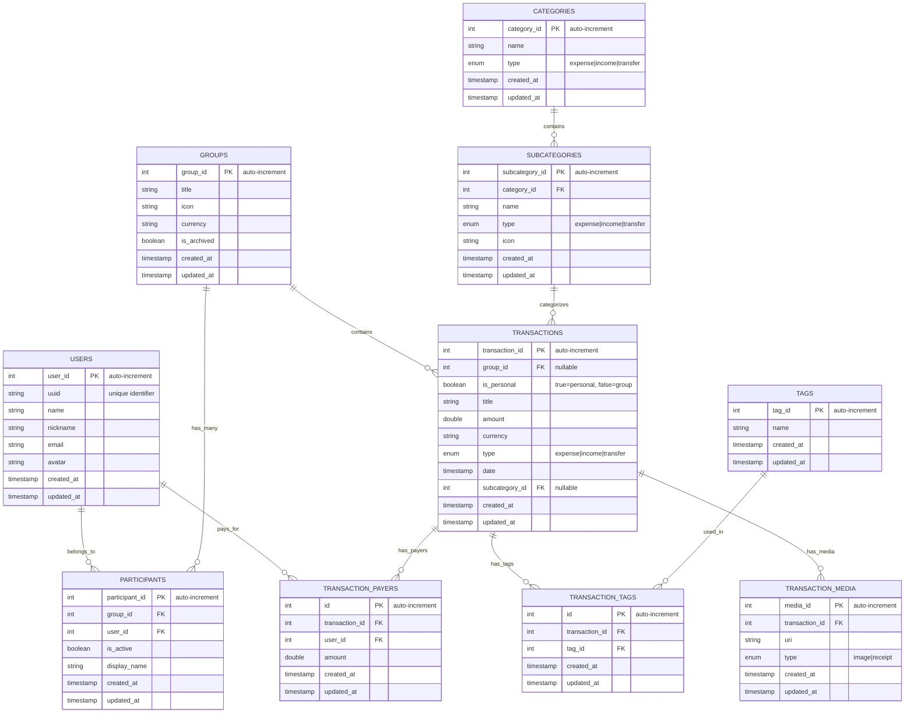

# Entity Relationship Diagram (ERD)

This document provides a visual representation of the database schema for the Scount expense tracking application using Mermaid diagrams.

## Database Schema Overview

The Scount app manages personal and group expenses with support for multiple payers, categories, tags, and media attachments.

## Entity Relationship Diagram

## Entity Descriptions

### 1. Users
- **Purpose**: Stores user account information
- **Key Fields**: `user_id` (Primary Key), `uuid` (Unique Identifier), `name`, `nickname`, `email`, `avatar`
- **Relationships**: Can participate in multiple groups via Participants table
- **Rules**: `uuid` must be unique across all users

### 2. Groups
- **Purpose**: Represents expense groups for shared expenses
- **Key Fields**: `group_id` (Primary Key), `title`, `icon`, `currency`, `is_archived`, `created_at`
- **Relationships**: 
  - Has many participants (via Participants table)
  - Has many transactions
  - Personal expenses have `group_id = NULL`
- **Rules**: 
  - `is_archived` defaults to `false` for new groups
  - Archived groups can be hidden from active group lists

### 3. Participants (Group Membership)
- **Purpose**: Junction table linking users to groups with role information
- **Key Fields**: `participant_id` (Primary Key), `group_id`, `user_id`, `is_active`, `display_name`
- **Rules**: 
  - Each participant must belong to exactly one group
  - Each participant must link to a valid user

### 4. Categories
- **Purpose**: Main expense/income/transfer categories
- **Key Fields**: `category_id` (Primary Key), `name`, `type` (expense, income, or transfer)
- **Relationships**: Has many subcategories

### 5. Subcategories
- **Purpose**: Detailed categorization under main categories
- **Key Fields**: `subcategory_id` (Primary Key), `category_id`, `name`, `type`, `icon`
- **Rules**: Type must match parent category type (expense, income, or transfer)

### 6. Tags
- **Purpose**: Global tags that can be applied to any transaction
- **Key Fields**: `tag_id` (Primary Key), `name`
- **Rules**: Tags are global and reusable across all groups/transactions

### 7. Transactions
- **Purpose**: Core expense/income records
- **Key Fields**: `transaction_id` (Primary Key), `group_id` (nullable), `title`, `amount`, `currency`, `type`, `date`, `subcategory_id`, `created_at`
- **Rules**: 
  - Can belong to a group or be personal (group_id = NULL)
  - Can have multiple payers and tags
  - `type` must be one of: 'expense', 'income', or 'transfer'

### 8. Transaction Payers
- **Purpose**: Supports multiple payers for a single transaction
- **Key Fields**: `id` (Primary Key), `transaction_id`, `user_id`, `amount`
- **Rules**: 
  - Each payer must be a valid user
  - If transaction has a group, payer must be in that group

### 9. Transaction Tags
- **Purpose**: Junction table for many-to-many relationship between transactions and tags
- **Key Fields**: `id` (Primary Key), `transaction_id`, `tag_id`

### 10. Transaction Media
- **Purpose**: Stores media attachments for transactions (receipts, images)
- **Key Fields**: `media_id` (Primary Key), `transaction_id`, `uri`, `type`
- **Rules**: Each media item is linked to exactly one transaction

## Key Relationship Rules

1. **Subcategory → Category**: One-to-Many
   - Each subcategory must belong to exactly one category

2. **Transaction → Tags**: Many-to-Many (via `transaction_tags`)
   - A transaction can have many tags, and a tag can be used in many transactions

3. **Transaction → Payers**: One-to-Many
   - A transaction can have multiple payers, each with their amount

4. **Group → Transactions**: One-to-Many
   - A group can have multiple transactions; personal transactions have no group

5. **Group → Participants**: One-to-Many
   - A group can have multiple participants

6. **User → Groups**: Many-to-Many (via Participants)
   - Users can participate in multiple groups

## Database Design Notes

- **Auto-increment IDs**: All primary keys use auto-increment integers for better WatermelonDB performance
- **External Sync**: Use UUIDs for external sync/API communication while maintaining auto-increment for local primary keys
- **Personal vs Group**: `is_personal` boolean field in transactions (true=personal, false=group)
- **Nullable Foreign Keys**: `group_id` in transactions allows for personal expenses
- **Currency Support**: Both groups and transactions have currency fields
- **Audit Trail**: `created_at` and `updated_at` timestamps for tracking and sync conflict resolution
- **Soft Deletes**: Consider adding `deleted_at` fields for soft deletion
- **Indexing**: Consider indexes on frequently queried fields like `user_id`, `group_id`, `date`

## WatermelonDB-Specific Considerations

### **1. Sync Strategy**
- **Multi-payer Transactions**: These will be complex to sync - consider how you'll handle conflicts when multiple users modify the same transaction
- **Group Membership**: Participants table will need careful sync handling for group invitations/removals
- **Conflict Resolution**: Use `updated_at` timestamps for conflict resolution during sync

### **2. Performance Optimizations**
- **Indexing**: Add indexes on frequently queried fields:
  - `user_id` in participants
  - `group_id` in transactions  
  - `date` in transactions
  - `subcategory_id` in transactions
  - `is_personal` in transactions
- **Query Patterns**: Optimize for common queries:
  - User's expenses (personal + group)
  - Group expenses with payer breakdowns
  - Category/subcategory summaries
  - Date range queries

### **3. Data Integrity**
- **Cascade Deletes**: Plan how you'll handle deletions:
  - What happens to transactions when a group is deleted?
  - What happens to transaction_payers when a user is removed from a group?
- **Foreign Key Constraints**: Ensure referential integrity during sync operations

### **4. External Sync Implementation**
- **UUID Mapping**: Maintain a separate mapping table for local IDs to external UUIDs
- **Sync Fields**: Add `external_id` (UUID) and `synced_at` fields to track sync status
- **Conflict Resolution**: Use `updated_at` timestamps to determine which record is newer

### **5. Migration Considerations**
- **Version Management**: Plan for schema migrations as your app evolves
- **Data Seeding**: Consider how you'll seed default categories/subcategories
- **User Onboarding**: Plan for initial data setup for new users

### **6. Complex Query Handling**
- **Multi-payer Aggregations**: Consider how to efficiently calculate totals when multiple users pay for one transaction
- **Group Expense Splitting**: Plan for complex expense splitting calculations
- **Reporting Queries**: Design efficient queries for expense summaries and reports

## Key App Queries

The app will need to support the following query patterns:

### **1. User Expense Queries**

#### **Personal Expenses**
- **User's personal expenses for specific month/year**: Filter personal transactions by date range
- **User's all personal expenses**: Retrieve all personal transactions without date filtering

#### **Group Expenses**
- **User's group expenses for specific month/year**: Filter group transactions by date range, including group name
- **User's all group expenses**: Retrieve all group transactions the user participates in

#### **All Expenses (Personal + Group)**
- **User's all expenses for specific month/year**: Combined view of personal and group expenses with source identification
- **User's all expenses (no date filter)**: Complete expense history from both personal and group sources

### **2. Group Balance Queries**

#### **Current Balance for Each Participant in a Group**
- **Participant balance calculation**: Calculate net balance (total paid - total owed) for each active participant in a specific group
- **Balance display**: Show participant names, amounts paid, amounts owed, and final balance

#### **Group Summary with Total Expenses**
- **Group overview**: Display total expenses, participant count, and transaction count for a specific group
- **Group statistics**: Show group currency and overall financial summary

### **3. Date Range Queries**

#### **Monthly Expenses**
- **Monthly summary**: Group expenses by month for trend analysis and monthly budgeting
- **Monthly statistics**: Show total amount and transaction count per month

#### **Yearly Expenses**
- **Yearly summary**: Group expenses by year for annual financial review
- **Yearly statistics**: Show total amount and transaction count per year

### **4. Category Analysis Queries**

#### **Expense by Category**
- **Category breakdown**: Group expenses by category and subcategory
- **Category statistics**: Show total amount and transaction count per category
- **Date-filtered categories**: Support date range filtering for category analysis

### **Query Performance Considerations**

- **Indexes Needed**:
  - `transactions(user_id, is_personal, date)`
  - `transactions(group_id, date)`
  - `participants(user_id, group_id, is_active)`
  - `transaction_payers(user_id, transaction_id)`
  - `subcategories(category_id)`

- **Caching Strategy**:
  - Cache monthly/yearly summaries
  - Cache group balances
  - Cache category breakdowns

- **Pagination**:
  - Implement pagination for large transaction lists
  - Use LIMIT/OFFSET or cursor-based pagination 